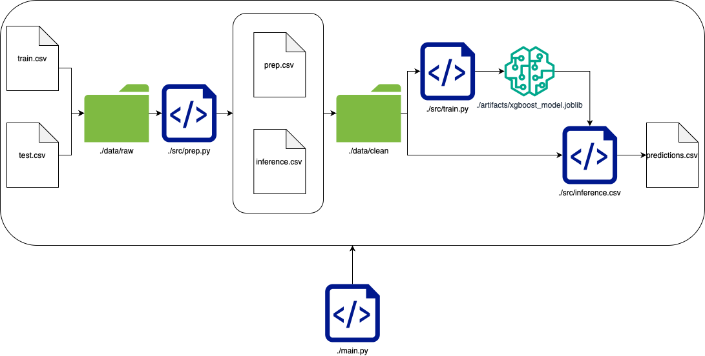

# 01_Tarea_MGS_Carlos_Mayorga
Repo para la primera tarea de métodos de gran escala
project_root/
project_root/
|-- main.py
|-- environment.yaml
|-- README.md
|-- results.log
|-- .gitignore
|-- LICENSE
|-- src/
|   |-- __init__.py
|   |-- prep.py
|   |-- train.py
|   |-- inference.py
|-- data/
|   |-- prediction.csv
|   |-- inference.csv
|   |-- prep.csv
|   |-- train.csv
|   |-- inference.csv
|-- artifacts/
|   |-- common_columns.yaml
|   |-- paramms.yaml
|-- notebooks/
|   |-- HPP_model.ipynb

